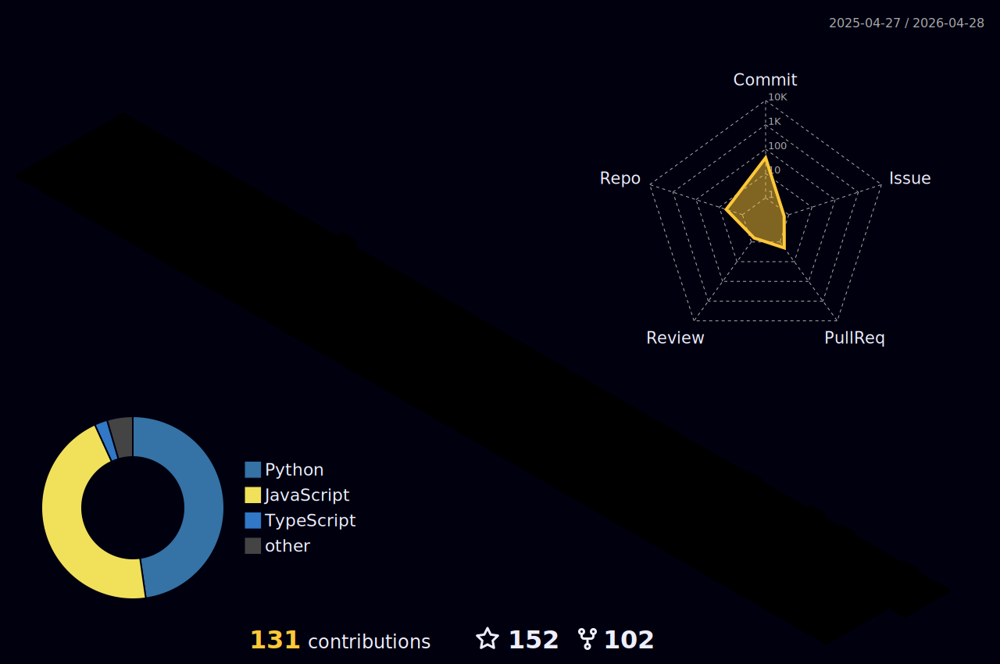

### Hi there 👋

I am Aryan Khanijo, currently working as a Software Engineer at the [SquareBoat Solutions](https://squareboat.com/). I am a Back-end developer (Python(Django)/JavaScript(Node.JS)) and love writing clean and maintainable code. Find out more about me & feel free to connect with me here:

## 👨 Socials

## 🧑‍💻 Languages

## 🚀 Frameworks & Library

<!-- 

 -->

## 📚 Storage

<!-- 
## 💡 Prototyping Platforms

 -->

## 💻 Terminals

## 💽 Operating System

## ⚡ Technologies

## 👩‍💻 IDE

 

## ⚙️ My Setup
### PC

## Laptop

